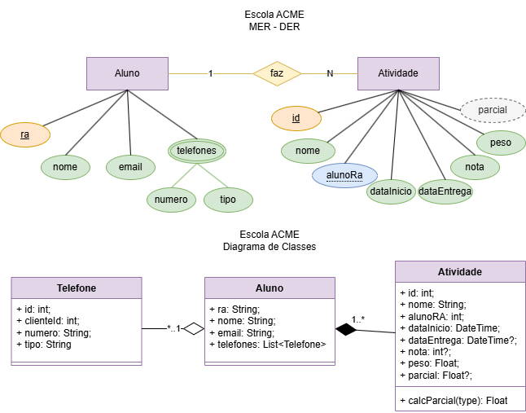

# ATIVIDADES ESCOLA ACME API
Situação de Aprendizagem - Back-End (Node.JS, JavaSript, VsCode, ORM Prisma, Insomnia)
## Contextualização
A ESCOLA ACME tem atuado em nossa cidade com ótimo atendimento e confiabilidade, é nossa cliente e necessita de um sistema Web para registro das atividades e notas de seus alunos. O P.O. após uma visita ao cliente, elaborou o DER e UML DC(Diagrama de Classes) a seguir e elencou os requisitos funcionais. 

## Desafio
Desenvolver as funcionalidades conforme requisitos

### Requisitos funcionais
- [RF001] O sistema deve permitir o CRUD de Alunos.
    - [RF001.1] O sistema deve permitir o CRUD de telefones, pois cada **aluno** pode possuir 0 ou vários telefones de tipos diferentes como celular, fixo ou comercial.
    - [RF001.2] A rota **read** do **aluno** deve mostrar os dados de todos os alunos e seus respectivos telefones.
    - [RF001.3] A rota **readOne** do **aluno** deve mostrar os dados de um aluno específico, seus telefones e suas **atividades**.
- [RF002] O sistema deve permitir o CRUD de Atividades.
    - [RF002.1] O sistema deve associar a atividade a um aluno.
    - [RF002.2] Ao cadastrar uma nova atividade **create** no controller, a dataInicio deve ser gerada pelo Banco de Dados @dedault(now()).
    - [RF002.3] Ao cadastrar uma nova atividade **create** no controller, a dataEntrega, a nota e a parcial podem ser nulas **"?"** pois serão preenchidas na rota **update** quando o aluno entregar e o professor corrigir.
    - [RF002.4] Se ao realizar **update** o campo **nota** for enviado o sistema deve calcular a **parcial** com a formula **"nota * peso / 10"**.

### Casos de teste (Insomnia)
- [CT001] Deve ser cadastrado pelo menos 5 alunos.
- [CT002] Deve ser cadastrado ao menos 1 telefone para cada aluno.
    - [CT002.1] Pelo menos dois alunos devem ter dois ou mais telefones cadastrados.
- [CT003] Cadastre, altere e exclua um aluno.
- [CT004] Cadastre uma atividade para cada aluno.
    - [CT004.1] Pelo menos um aluno deve ter duas ou mais atividades cadastradas.
- [CT005] Cadastre, altere e exclua uma atividade.

## Tecnologias
Backend: Node.js (v18+)

Linguagem: JavaScript

Banco de Dados: MySQL (ou outro compatível com Prisma)

ORM: Prisma

Ambiente de Desenvolvimento: Visual Studio Code

Testes de API: Insomnia

Controle de Versão: Git

Gerenciamento de Pacotes: npm ou yarn

## Passo a Passo de como executar a API

Passo a Passo Resumido para Executar a API:

Clone o repositório e acesse a pasta /api.

Instale as dependências com npm install.

Configure o ambiente:

Renomeie .env.example para .env

Preencha DATABASE_URL com seus dados de conexão MySQL

Execute as migrações do Prisma: npx prisma migrate dev --name init.

(Opcional) Popule o banco com dados de teste: npx prisma db seed.

Inicie o servidor: npm run dev (irá rodar na porta 3000).

Para testar:

Use o Insomnia com as rotas /api/alunos e /api/atividades

Siga a sequência de testes [CT001] a [CT005] do documento

Dica rápida:

Verifique erros nos logs do servidor

Acesse npx prisma studio para visualizar os dados

Mantenha o .env seguro e atualizado

A API estará pronta para cadastrar alunos, telefones e atividades conforme os requisitos.